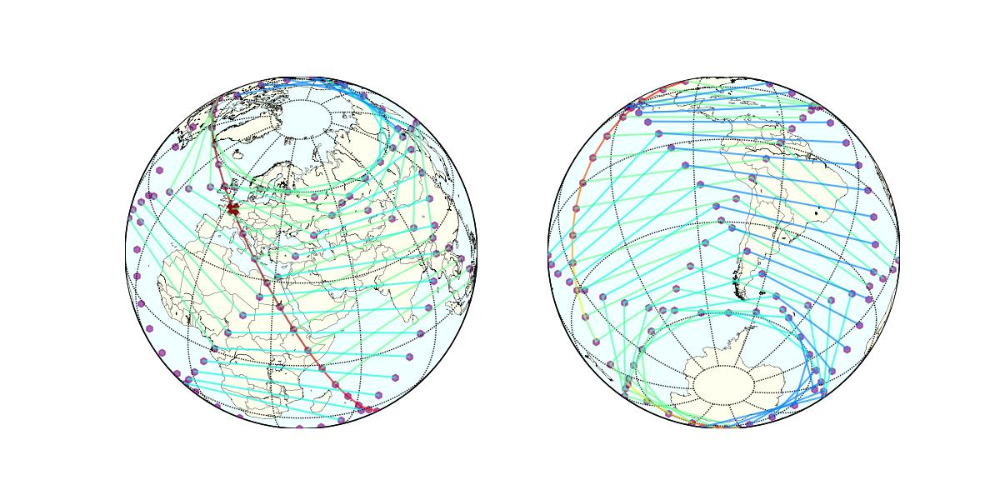
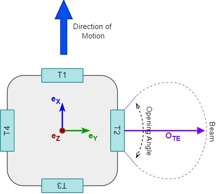
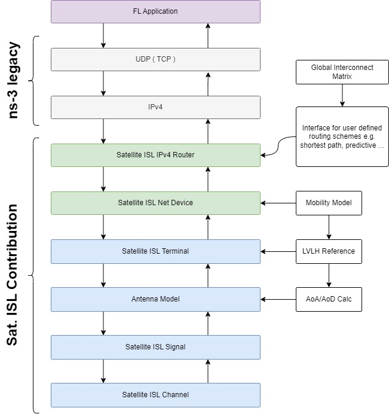

# ns-3 Extension for Satellite Networks with ISLs

## Custom Satellite Setup
The custom Satellite Setup allows to configurete a realistic spacecraft with multiple terminals with individual characteristics. The antenna model calculates precise AoA/AoD angles based on the terminal position and the momentary orientation of the spacecraft.

## Stack

The Models are designed to work with the IPv4 Stack of ns-3. This enables simulation of well-known protocols in large Satellite Networks or test new ones.

